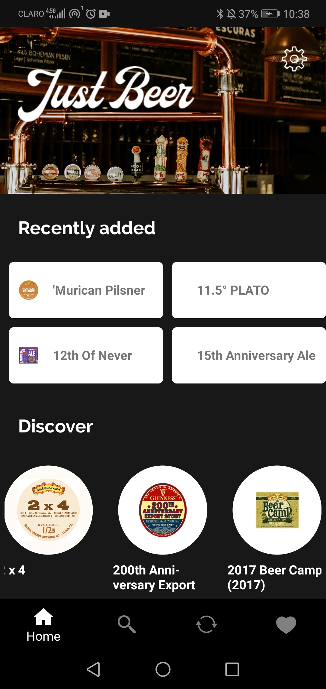
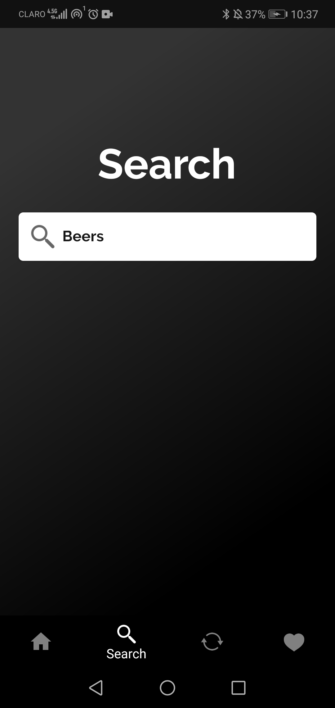
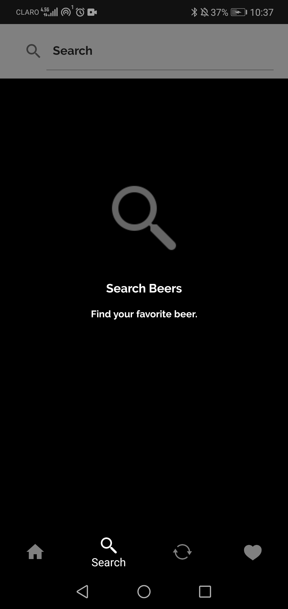
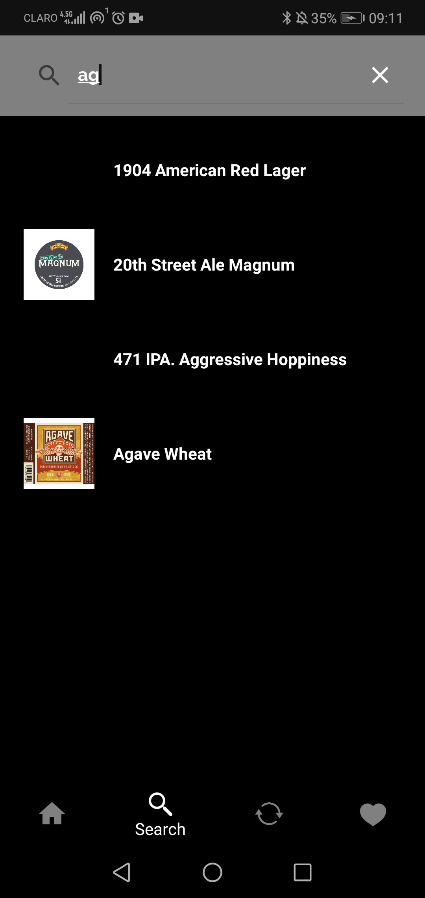
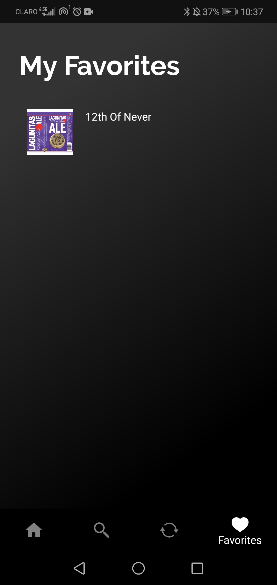
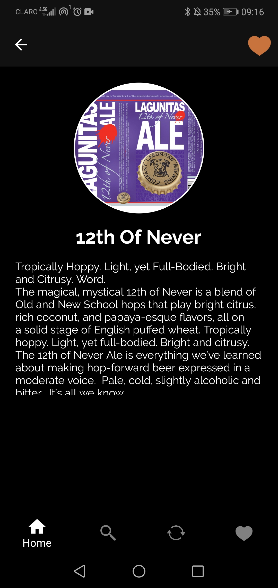
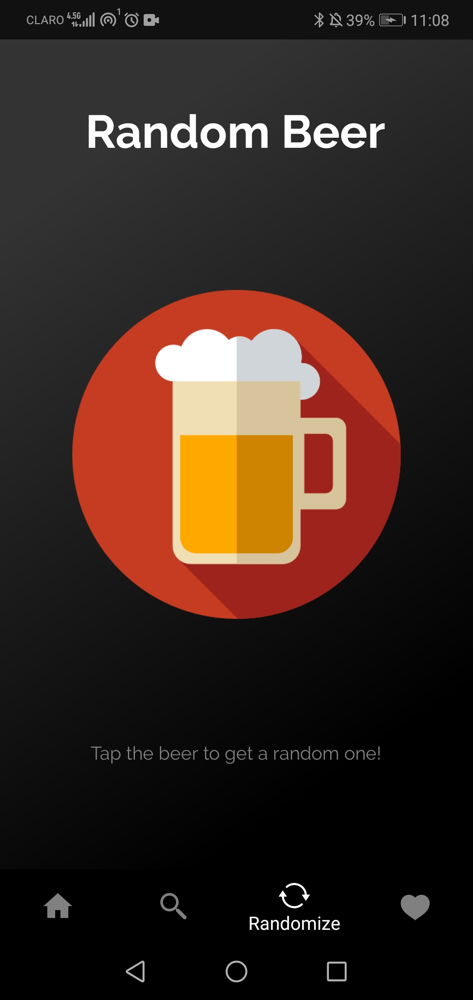
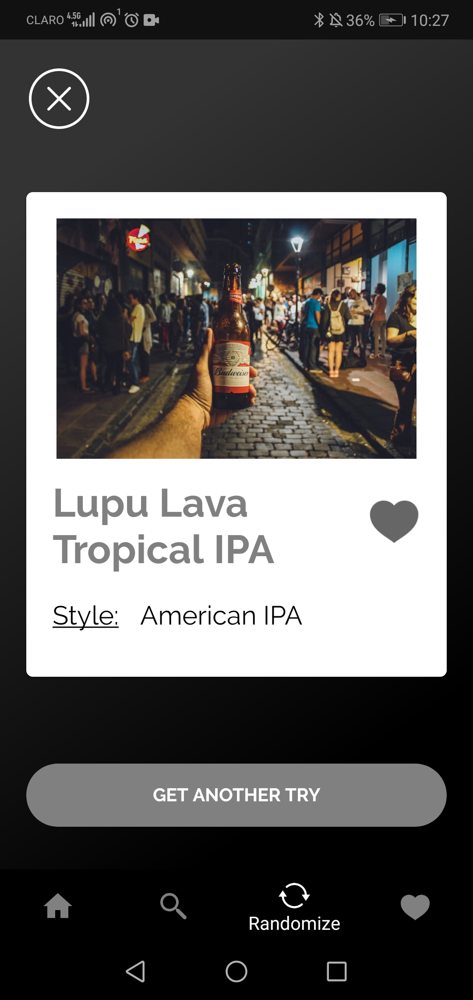

# Just Beer App

*Mobile application for beer lovers*

This is a sample app wich consume information from the BreweryDB and alows users to navigate and find beers.

It allows:
- Search beers by name
- For a determinated beer, visualize it description
- Make a personal list of favorites beers
- Get a random beer

**Note:** To test replace the ApiKey to use your own BreweryDB Api Key in Config.cs

<table border="0" cellpadding="0" cellspacing="0">
<tr>
<td>   </td>
<td>   </td>
<td></td>
</tr>
</table>

# Screenshots
<table>
<tr>
<td></td>
<td>   </td>
<td></td>
</tr>
</table>

## Search 
<table>
<tr>
<td></td>
<td>   </td>
<td></td>
</tr>
</table>

## Favorites 
<table>
<tr>
<td></td>
<td>   </td> 
<td></td>
</tr>
</table>

## Random 
<table>
<tr>
<td></td>
<td>   </td>
<td></td>
</tr>
</table>

## The team

- Kemberly Miliano - 1086391
https://github.com/DiegoJavierJ - 1087228 
- Axel Lopez - 1088114
## Work Division
https://trello.com/b/hq68GMbZ/justbeerapp
## Mockup Link
https://drive.google.com/file/d/1NFNZ-mDC17O4hD6wRS0g_-2Fmbe0i-fC/view?usp=sharing
## Tools used

- **Xamarin.Essentials** - Essential cross platform APIs for your mobile apps.     
https://github.com/xamarin/Essentials

- **Prism.Unity.Forms** - Framework for building loosely coupled, maintainable, and testable XAML applications in WPF, Windows 10 UWP, and Xamarin Forms.
https://github.com/PrismLibrary/Prism/releases/tag/v7.2.0.1422

- **MonkeyCache.FileStore** - Easily cache any data structure for a specific amount of time in any .NET application.
https://github.com/jamesmontemagno/monkey-cache

- **Newtonsoft.Json** - Flexible JSON serializer for converting between .NET objects and JSON.
https://github.com/JamesNK/Newtonsoft.Json 

- **Plugin.Fingerprint** - Xamarin and MvvMCross plugin for authenticate a user via fingerprint sensor.
https://github.com/smstuebe/xamarin-fingerprint

- **Xamarin.Forms.PancakeView** - An extended ContentView for Xamarin.Forms with rounded corners, borders, shadows and more.    
https://github.com/sthewissen/Xamarin.Forms.PancakeView

- **PropertyChanged.Fody** - Handles property changed events.      
https://github.com/Fody/PropertyChanged

- **Acr.UserDialogs** - A cross platform library that allows you to call for standard user dialogs from a shared/portable library. 
https://github.com/aritchie/userdialogs

- **BreweryDB** - Database of breweries and beers by BrewLogix.
https://www.brewerydb.com

- **Icon8 Icons** - Free design resources sand software.       
https://icons8.com
